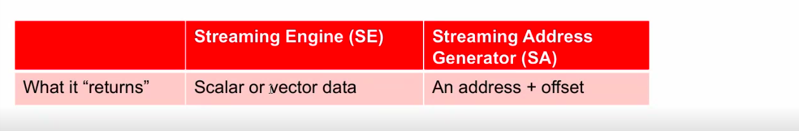

## Streaming Engine
* It provides higher bandwidth for reading large amount of data into DSP via 2 Streaming Engines
* It prefetches data directly from L2 cache
* It access upto 6 dimensions of data
* Streaming engine itself calaculate memory address
* It is also used to flatten the nested loops 
* It is also helpful to make several data formatting and pattern access features
* The user need to do C/C++ program to use Streaming engine 
* To use Streaming engine, we need to setup

* DIMFMT : 2d,3d,4d,5d,6d
* VECLEN - No of element going to lead (it stores upto 512 bits)
* ELETYPE - Elemennt Type
* __SE0ADV - Increment the pointer like next 512 bit
* __SE0_CLOSE() - To close the Streaming Engine
### Basics

## Streaming Address Generator 
* It Generates the address offsets
* There are 4 Address Generator : SA0,SA1,SA2,SA3
* It is used for Load and store the data ,where SE have onlu Load
* Compiler does not automatically use te SA , user need to program it 
